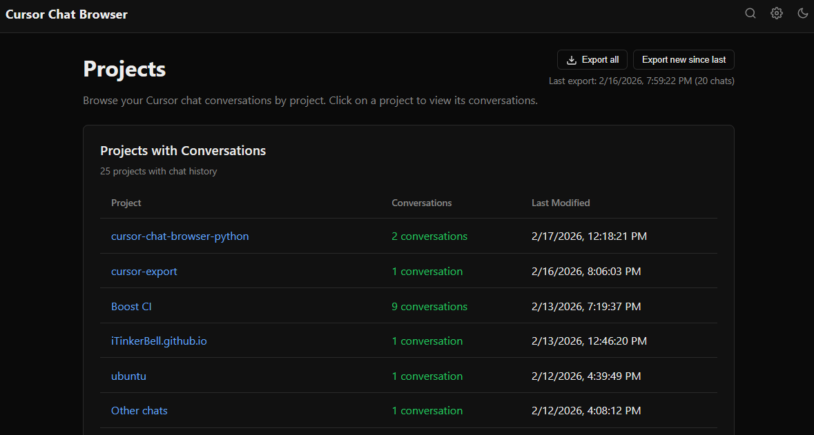
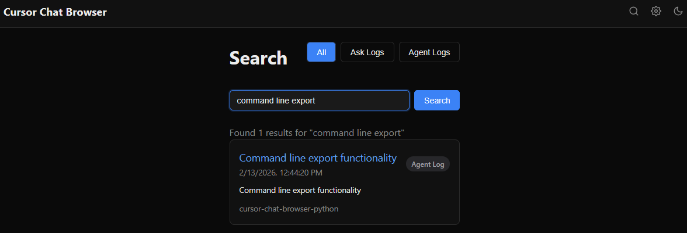
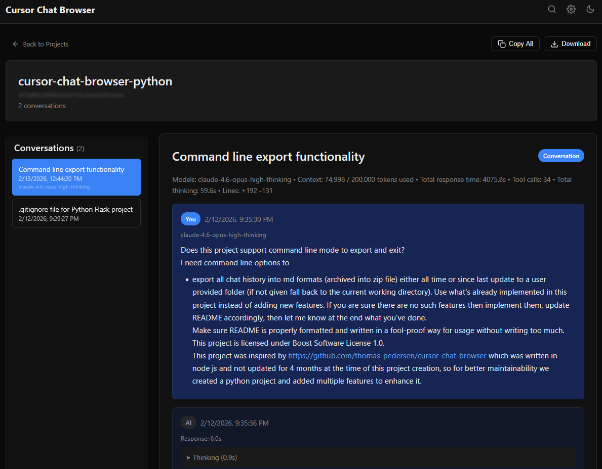
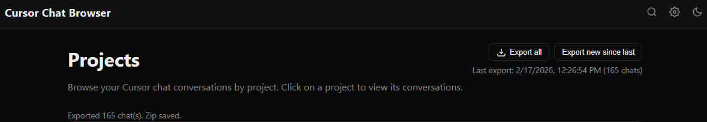

# Cursor Chat Browser (Python)

A Python web application for browsing and managing chat histories from the Cursor editor's AI chat feature. View, search, and export your AI conversations in various formats.

Inspired by [cursor-chat-browser](https://github.com/thomas-pedersen/cursor-chat-browser) (Node.js). This Python rewrite was created for easier maintenance and to add additional features such as CLI zip export, richer Markdown frontmatter, and a zero-build-step frontend.

## Features

- Browse and search all workspaces with Cursor chat history
- Support for both workspace-specific and global storage (newer Cursor versions)
- **Cursor CLI agent sessions** — browses and exports sessions from `cursor agent` (stored in `~/.cursor/chats/`)
- View AI chat and Composer/Agent logs
- Organize chats by workspace/project
- Full-text search with filters for chat/composer logs
- Responsive design with dark/light mode support
- Export chats as Markdown, HTML, PDF, JSON, or CSV
- **CLI export** with zip archive support and incremental (`--since last`) mode
- Syntax highlighted code blocks
- Bookmarkable chat URLs
- Automatic workspace path detection

## Samples

This repo includes a real exported conversation and a few screenshots so you can quickly see what the Projects list, Search, conversation view, and one-click export look like.

- **Example chat export (Markdown)**: [`samples/example_chat_export.md`](samples/example_chat_export.md) (includes YAML frontmatter + transcript, with tool calls / thinking blocks when present)

<details>
<summary>Screenshots (Web UI)</summary>

_Projects list (home):_


_Search across chats and logs:_


_Conversation view (chat transcript + metadata):_


_One-click export from the UI:_


</details>

## Prerequisites

- Python 3.10+
- A Cursor editor installation with chat history

## Installation

```bash
cd cursor-chat-browser-python
python -m venv venv

# Windows
venv\Scripts\activate
# macOS / Linux
source venv/bin/activate

pip install -r requirements.txt
```

## Quick Start (Web UI)

```bash
python app.py
```

Open <http://localhost:3000> in your browser.

## CLI Export

Export chat history to Markdown without starting the web server. Running with no arguments exports **everything** (all chats + composer logs) as a zip archive into the current directory.

```bash
# Export everything (zip) into the current directory — the most common usage
python scripts/export.py

# Export only chats updated since the last export, save zip to a specific folder
python scripts/export.py --since last --out /path/to/folder

# Export as individual Markdown files instead of a zip
python scripts/export.py --no-zip --out ./my-export

# Export only chat logs (exclude composer logs)
python scripts/export.py --no-composer
```

### CLI Options

| Flag | Description | Default |
|------|-------------|---------|
| `--since all` | Export all chats | `all` |
| `--since last` | Export only chats updated since last export | |
| `--out DIR` | Output directory | `.` (current directory) |
| `--no-zip` | Write individual Markdown files instead of a zip archive | zip on |
| `--no-composer` | Exclude composer logs (export only chat logs) | included |
| `--help` | Show help and exit | |

### Output

- **Zip mode** (default): A single `cursor-export-YYYY-MM-DD.zip` file containing all Markdown files organized by date, workspace, and chat.
- **File mode** (`--no-zip`): Individual Markdown files at `<out>/YYYY-MM-DD/<workspace>/chat/<timestamp>__<title>__<id>.md`, plus a `manifest.jsonl` index.
- Each Markdown file includes YAML frontmatter (log ID, title, timestamps, message count, model, token usage, tool calls, etc.) and the full conversation transcript.
- IDE chats are written under `<workspace>/chat/`; Cursor CLI agent sessions are written under `<workspace>/cli/`.
- If the Cursor IDE database is absent (e.g. on a machine with only `cursor agent` installed), only CLI sessions are exported — the script no longer exits with an error.

Export state is saved to `~/.cursor-chat-browser/export_state.json` so that `--since last` works across runs.

## Configuration

The application automatically detects your Cursor workspace storage location:

| OS | Path |
|----|------|
| Windows | `%APPDATA%\Cursor\User\workspaceStorage` |
| WSL2 | `/mnt/c/Users/<USERNAME>/AppData/Roaming/Cursor/User/workspaceStorage` |
| macOS | `~/Library/Application Support/Cursor/User/workspaceStorage` |
| Linux | `~/.config/Cursor/User/workspaceStorage` |
| Linux (SSH) | `~/.cursor-server/data/User/workspaceStorage` |

To override, set the `WORKSPACE_PATH` environment variable or use the Configuration page in the web UI.

Cursor CLI agent sessions are read from `~/.cursor/chats/` (the default path used by the `cursor agent` CLI). Override with the `CLI_CHATS_PATH` environment variable.

## Project Structure

```
cursor-chat-browser-python/
├── app.py                  # Flask application entry point
├── requirements.txt        # Python dependencies
├── api/                    # API route blueprints
│   ├── workspaces.py       # /api/workspaces endpoints
│   ├── composers.py        # /api/composers endpoints
│   ├── logs.py             # /api/logs endpoint
│   ├── search.py           # /api/search endpoint
│   ├── export_api.py       # /api/export endpoint (web)
│   ├── pdf.py              # /api/generate-pdf endpoint
│   └── config_api.py       # Config-related endpoints
├── utils/                  # Utility modules
│   ├── workspace_path.py   # Workspace path detection (IDE + CLI)
│   ├── cli_chat_reader.py  # Reader for Cursor CLI agent sessions (~/.cursor/chats/)
│   ├── cursor_md_exporter.py # Markdown exporter for CLI agent sessions
│   ├── path_helpers.py     # Path normalization helpers
│   ├── text_extract.py     # Text extraction from bubbles
│   └── tool_parser.py      # Tool call parsing
├── scripts/
│   └── export.py           # CLI export script
├── static/                 # Static assets (no npm required)
│   ├── css/style.css
│   └── js/
│       ├── app.js
│       └── download.js
└── templates/              # Jinja2 HTML templates
    ├── base.html
    ├── index.html
    ├── config.html
    ├── search.html
    └── workspace.html
```

## Technology Stack

- **Backend:** Python 3, Flask
- **Database:** sqlite3 (built-in) — reads Cursor's SQLite databases directly
- **Frontend:** Vanilla HTML/CSS/JS (no npm, no build step)
- **PDF:** fpdf2

## License

This project is licensed under the [Boost Software License 1.0](https://www.boost.org/LICENSE_1_0.txt).
